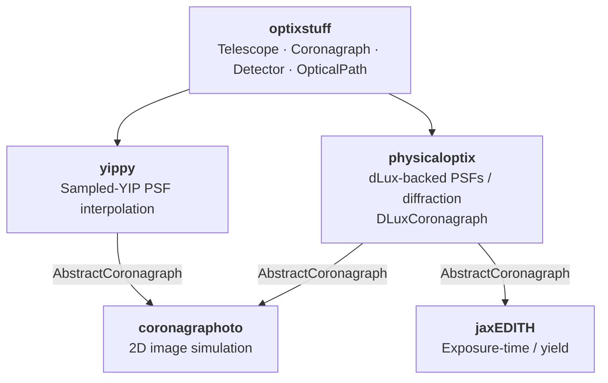

# physicaloptix

Physical optics — PSFs and diffraction — for the HWO direct-imaging
simulation suite.

## What physicaloptix is

`physicaloptix` turns an [optixstuff](https://github.com/CoreySpohn/optixstuff)
hardware description into point-spread functions by wave-optics propagation,
using [dLux](https://github.com/LouisDesdoigts/dLux) as the (hidden, swappable)
backend. It is a downstream consumer of optixstuff — parallel to
[coronagraphoto](https://github.com/CoreySpohn/coronagraphoto) (2D image
simulation) and [jaxEDITH](https://github.com/CoreySpohn/jaxedith)
(exposure-time and yield calculations) — so optixstuff itself stays free of
diffraction code.

The key piece is `DLuxCoronagraph`, which implements optixstuff's
`AbstractCoronagraph`. Build one from an optixstuff primary and hand it to any
downstream tool: it is consumed as an `AbstractCoronagraph`, so coronagraphoto
and jaxEDITH get dLux-propagated PSFs by dependency injection, without depending
on physicaloptix or dLux themselves.

```python
import physicaloptix as po

coro = po.DLuxCoronagraph.from_primary(primary)      # optixstuff in, dLux hidden
psf = coro.on_axis_psf(600.0, pixel_scale_rad, npix)  # PSF out
```

## What physicaloptix is *not*

- **Not a hardware model.** The telescope / coronagraph / detector description
  lives in [optixstuff](https://github.com/CoreySpohn/optixstuff); physicaloptix
  consumes it.
- **Not a PSF interpolator.** That's [yippy](https://github.com/CoreySpohn/yippy)'s
  job (a sampled YIP table). physicaloptix is its functional sibling — live
  propagation — and both back the same `AbstractCoronagraph` slot.
- **Not a scene model.** Stars, planets, disks, and zodi live in
  [skyscapes](https://github.com/CoreySpohn/skyscapes).

## Architecture

Built on [JAX](https://github.com/google/jax),
[Equinox](https://github.com/patrick-kidger/equinox), and
[dLux](https://github.com/LouisDesdoigts/dLux), `physicaloptix` provides:

- **The optixstuff -> dLux adapter** — `to_dlux_aperture`, a `singledispatch`
  that renders each optixstuff primary type into a dLux aperture (segmented hex
  -> `MultiAperture`, simple circular -> `CircularAperture`).
- **A dLux-backed coronagraph** — `DLuxCoronagraph`, an optixstuff
  `AbstractCoronagraph` producing `on_axis_psf` / `off_axis_psf` by propagation.
- **A facade** — `psf(primary, ...)`, a one-liner from primary to PSF.

### Ecosystem position



## Installation

```bash
pip install physicaloptix
```

## Status

This package is in early development (pre-v0.1.0). No coronagraph mask
(focal-plane / Lyot) is modelled yet, so `on_axis_psf` is currently the
telescope PSF.
