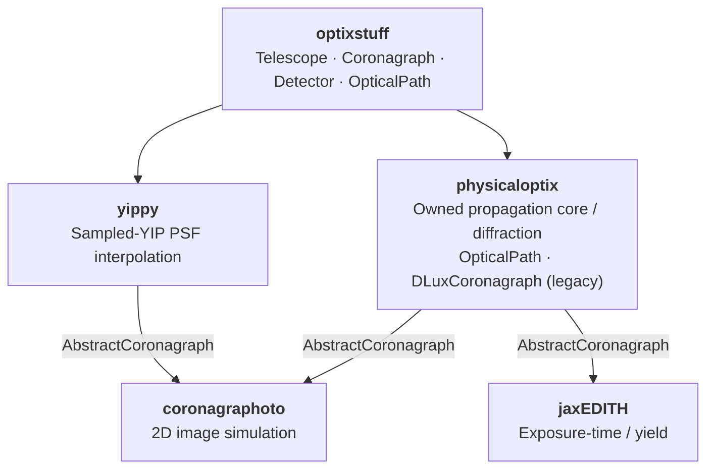

# physicaloptix

Physical optics — PSFs and diffraction — for the HWO direct-imaging
simulation suite.

## What physicaloptix is

`physicaloptix` turns an [optixstuff](https://github.com/CoreySpohn/optixstuff)
hardware description into point-spread functions by wave-optics propagation.
It is a downstream consumer of optixstuff — parallel to
[coronagraphoto](https://github.com/CoreySpohn/coronagraphoto) (2D image
simulation) and [jaxEDITH](https://github.com/CoreySpohn/jaxedith)
(exposure-time and yield calculations) — so optixstuff itself stays free of
diffraction code.

The propagation core is owned: a
plane-aware `Field`/`Grid` data model, the continuous-FT MFT pair, the
multi-scale vortex, and the `OpticalPath` fold with construction-time
sampling gates, validated against the HWO Coronagraph Design Survey
(cds_pipeline) EAC-1 AAVC to an on-axis null of 3.05e-11 (0.2 percent of the
reference; the acceptance gates live in `tests/validation/`).
[dLux](https://github.com/LouisDesdoigts/dLux) remains the legacy backend
behind `DLuxCoronagraph` until the path-backed adapter replaces it.

The key piece is `DLuxCoronagraph`, which implements optixstuff's
`AbstractCoronagraph`. Build one from an optixstuff primary and hand it to any
downstream tool: it is consumed as an `AbstractCoronagraph`, so coronagraphoto
and jaxEDITH get dLux-propagated PSFs by dependency injection, without depending
on physicaloptix or dLux themselves.

```python
import physicaloptix as po

coro = po.DLuxCoronagraph.from_primary(primary)      # optixstuff in, dLux hidden
psf = coro.on_axis_psf(600.0, pixel_scale_rad, npix)  # PSF out
```

## What physicaloptix is *not*

- **Not a hardware model.** The telescope / coronagraph / detector description
  lives in [optixstuff](https://github.com/CoreySpohn/optixstuff); physicaloptix
  consumes it.
- **Not a PSF interpolator.** That's [yippy](https://github.com/CoreySpohn/yippy)'s
  job (a sampled YIP table). physicaloptix is its functional sibling — live
  propagation — and both back the same `AbstractCoronagraph` slot.
- **Not a scene model.** Stars, planets, disks, and zodi live in
  [skyscapes](https://github.com/CoreySpohn/skyscapes).

## Architecture

Built on [JAX](https://github.com/google/jax) and
[Equinox](https://github.com/patrick-kidger/equinox), `physicaloptix` provides:

- **The owned core** (`physicaloptix.core`) — `Grid` (all-static, half-pixel
  offset, continuous-FT weights), `PlaneKind`-tagged `Field` pytrees, and
  `Spectrum` for chromatic fields.
- **Propagators** (`physicaloptix.transforms`) — the validated `cmft_fwd` /
  `cmft_bwd` continuous-FT MFT pair and the plane-aware `Fraunhofer` wrapper,
  with sampling diagnostics evaluated at construction time.
- **Elements** (`physicaloptix.elements`) — grid-stamped `SampledOptic` for
  ingested masks and the `MultiScaleVortex` ladder (hcipy port; reaches the
  cds EAC-1 on-axis null).
- **The optical path** (`physicaloptix.path`) — `OpticalPath`, named plane-checked
  stages folded once, with static taps for free instrumented propagation.
- **The speckle layer** — `SpeckleProcess` / `AnalyticSpeckleField`, the
  linear speckle generator (E_nom, G) behind optixstuff's `AbstractSpeckleField`.
- **The legacy dLux path** — `to_dlux_aperture`, `DLuxCoronagraph`, and the
  `psf(primary, ...)` facade, kept until the path-backed adapter lands.

### Ecosystem position



## Installation

```bash
pip install physicaloptix
```

## Status

Early development. The owned core propagates a full apodized vortex
coronagraph chain (see `tests/validation/`); the legacy `DLuxCoronagraph`
facade models no mask yet, so its `on_axis_psf` is the telescope PSF until
the path-backed adapter replaces it.
