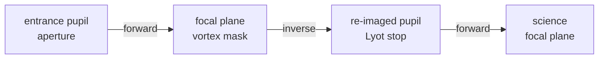

# Architecture

This page explains how physicaloptix is put together: the core types, how
they compose into a propagation, and where the library's responsibilities
start and stop. It is background reading -- for runnable code, start with the
[tutorials](../examples/01_Grids_and_Fields), and for where these design ideas come from and how the
library compares to hcipy, dLux, poppy, prysm, and chromatix, see
[related work](related-work).

## The one-sentence model

A physicaloptix simulation is a **field pushed through a path**. A
{class}`~physicaloptix.Field` is a complex wavefront living on a
{class}`~physicaloptix.Grid`; an {class}`~physicaloptix.OpticalPath` is a
sequence of {class}`~physicaloptix.Stage` operations. Calling
`path.propagate(field)` folds the field through every stage and returns the
field at the end. Everything else is a kind of stage, a kind of grid, or a way
to build one of those.

Because the whole thing is built on [JAX](https://github.com/google/jax) and
[Equinox](https://github.com/patrick-kidger/equinox), a path is a PyTree and
`propagate` is a pure function. You can `jax.jit` it, `jax.vmap` it over
wavelength or field angle, and take gradients through it with respect to any
leaf -- a mirror shape, a mask parameter, a source position.

## The data model: `Grid`, `Field`, `PlaneKind`

A `Grid` is an all-static sampling of a plane. It carries its pixel count and
pitch and the coordinate weights the propagators need; nothing about it is
traced, so it can be compared and validated at construction time. Two
factories cover the common cases: a pupil-plane grid spanning the aperture,
and a focal-plane grid sampled in units of $\lambda/D$.

A `Field` is the complex array of the wavefront, stamped with the `Grid` it
lives on and a `PlaneKind` tag -- `PUPIL`, `INTERMEDIATE`, or `FOCAL`. The tag
is not decoration: propagators declare which plane they consume and which they
produce, so a mis-wired train (a focal-plane mask handed a pupil field, say)
fails when the path is built rather than producing a quietly wrong number at
runtime. For chromatic work, a `Spectrum` carries a field across a set of
wavelengths so one path can be propagated polychromatically.

## Propagation: the continuous-Fourier MFT pair

The core numerical operation is a matrix discrete Fourier transform written as
a *continuous* Fourier transform -- a pair of forward and inverse transforms
(`cmft_fwd` / `cmft_bwd`) that map between a pupil grid and a focal grid at an
arbitrary, caller-chosen focal sampling. Unlike an FFT, the output sampling is
decoupled from the input array size, so you can oversample the core of a PSF
without padding the pupil.

{class}`~physicaloptix.Fraunhofer` wraps this pair for far-field (focal-plane)
propagation; {class}`~physicaloptix.Fresnel` handles near-field propagation
over a finite distance, which is what converts a pure phase error into an
amplitude error as it propagates. Both evaluate their sampling adequacy when
the stage is constructed and can be told to warn or raise if the grid
undersamples the transform, so sampling errors surface as a clear message
instead of aliasing.

## Elements: masks, optics, and wavefront error

Everything that sits in a path between propagators is an element:

- {class}`~physicaloptix.SampledOptic` -- a grid-stamped amplitude or phase
  screen (a Lyot stop, an apodizer).
- {class}`~physicaloptix.MultiScaleVortex` -- a charge-`n` vortex focal-plane
  mask, evaluated on a multi-resolution grid ladder so the sharp phase ramp at
  its center is well sampled.
- {class}`~physicaloptix.PhaseScreen` over a {class}`~physicaloptix.ModeBasis`
  -- wavefront error and wavefront control both enter this way. A basis is a
  stack of modes (Zernike, band-limited Fourier / deformable-mirror,
  segment piston-tip-tilt) plus a coefficient vector. Because the coefficients
  are ordinary PyTree leaves, a screen is differentiable and swappable with
  `equinox.tree_at` -- the same mechanism a gradient-based dark-hole solver
  uses to drive it.

## Paths, systems, and the coronagraph slot

A single-branch `OpticalPath` is a tuple of `Stage`s. When a design splits the
beam -- a science arm and a wavefront-sensing arm behind a dichroic -- an
{class}`~physicaloptix.OpticalSystem` with a
{class}`~physicaloptix.BeamSplitter` propagates the shared trunk once into
named branches, with energy-conservation checks at the split. The
[instrument-subsystems tutorial](../examples/07_Instrument_Subsystems) works
this through, alongside the detector readout and the integral-field
spectrograph.

{class}`~physicaloptix.PathCoronagraph` is the interoperability layer. It wraps
an `OpticalPath` and presents the `AbstractCoronagraph` interface that the rest
of the simulation suite consumes: an on-axis PSF, a throughput curve, an inner
working angle. The defining property is that these are **derived from the
propagated PSFs at construction, never declared** -- the inner working angle is
measured from where the coronagraph starts passing off-axis light, not read
from a configuration file. This is what lets a live-propagation coronagraph and
a precomputed sampled-table coronagraph fill the same slot interchangeably.

## How a Lyot coronagraph is laid out

A coronagraph path reads as a short list of stages, but it hides a plane
sequence worth making explicit. A {term}`vortex coronagraph` mask lives at a
*focal* plane, yet the {term}`Lyot stop` after it lives at a *pupil*. The mask
stage therefore has to re-image the pupil: it propagates the entrance pupil to a
focal plane, applies the phase mask there, and propagates back to a re-imaged
pupil. That pupil-to-focal-to-pupil hop is the defining structure of a Lyot
coronagraph.

In physicaloptix that whole hop is encapsulated inside a single
{class}`~physicaloptix.MultiScaleVortex` stage, which maps a pupil field to the
post-mask (Lyot-plane) pupil field. This is why a coronagraph `OpticalPath`
lists only `vortex`, `lyot`, and a final `Fraunhofer` even though four planes
are involved. The mask stage is built with `MultiScaleVortex.build(charge, npup,
q, scaling_factor, window_size)`: `charge` is the physical {term}`vortex charge`,
while `q`, `scaling_factor`, and `window_size` are numerical knobs that set the
multi-resolution focal-grid ladder the mask uses to stay sampled through its
central phase singularity.

## The speckle layer

Deep contrast is limited by residual starlight -- speckles -- not by the ideal
PSF. {func}`~physicaloptix.linearize` reduces any path to its first-order
model about an operating point: a nominal field `E_nom` and a Jacobian `G`
that maps small wavefront perturbations to focal-field changes. That linear
`(E_nom, G)` pair is the generator behind
{class}`~physicaloptix.SpeckleProcess` and
{class}`~physicaloptix.AnalyticSpeckleField`, and it feeds the statistical
tools in `physicaloptix.stats`. The [speckle theory tutorial](../examples/05_Speckles_from_First_Principles) builds
this picture up from first principles, and the [speckle-layer-in-code tutorial](../examples/06_The_Speckle_Layer_in_Code)
drives the `linearize` / `stats` / `SpeckleProcess` API end to end. The same `(E_nom, G)` product is the seam the
`tiptilt` library builds on: physicaloptix supplies the linearization, and
tiptilt uses it to generate drifting wavefront-error realizations and to close a
wavefront-control loop.

## Scope: what lives elsewhere

physicaloptix is deliberately narrow. It does the diffraction and nothing else:

- The **hardware description** -- telescope aperture, coronagraph choice,
  detector, filters -- lives in
  [optixstuff](https://optixstuff.readthedocs.io/). physicaloptix consumes it.
- **Sampled PSF tables** are [yippy](https://yippy.readthedocs.io/)'s job.
  physicaloptix is the live-propagation sibling; both back the same
  `AbstractCoronagraph` slot, and downstream tools cannot tell them apart.
- **Image simulation** (assembling a scene onto a detector) is
  [coronagraphoto](https://coronagraphoto.readthedocs.io/), and
  **exposure-time and yield** calculations are
  [jaxedith](https://github.com/CoreySpohn/jaxedith).
- **Scenes** -- stars, planets, disks, zodiacal light -- live in
  [skyscapes](https://github.com/CoreySpohn/skyscapes).
- **Wavefront control and aberration generation** live in
  [tiptilt](https://github.com/CoreySpohn/tiptilt), which consumes the
  `(E_nom, G)` linearization to close a dark-hole loop and to produce drifting
  wavefront-error realizations. physicaloptix provides the propagation and the
  linearization; tiptilt drives them.

Keeping these boundaries sharp is what keeps physicaloptix a propagation engine
rather than a monolith: it can be tested against diffraction ground truth in
isolation, and reused by any tool that needs a PSF.
