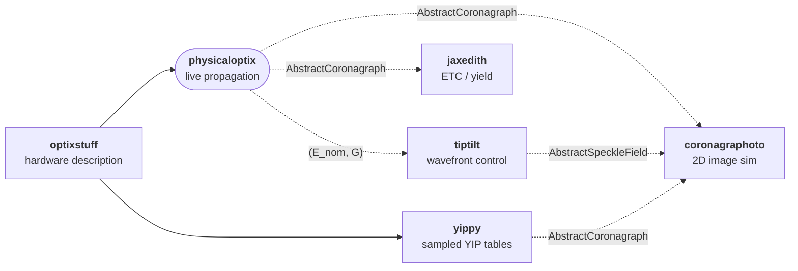

# physicaloptix

JAX-native physical optics -- PSFs and diffraction -- for the HWO
direct-imaging simulation suite.

`physicaloptix` turns a description of an optical system into point-spread
functions by wave-optics propagation. It owns its propagation core: a
plane-aware `Grid` / `Field` data model, the validated continuous-Fourier
matrix-DFT pair, the multi-scale vortex, and the `OpticalPath` fold with
construction-time sampling gates. Built on
[JAX](https://github.com/google/jax) and
[Equinox](https://github.com/patrick-kidger/equinox), the whole path is
differentiable and JIT-compilable, so you can `vmap` a propagation over
wavelength or field angle and take gradients through it.

The central type, {class}`~physicaloptix.PathCoronagraph`, implements
optixstuff's `AbstractCoronagraph`: build an {class}`~physicaloptix.OpticalPath`
from entrance pupil to Lyot plane, wrap it, and hand it to any downstream tool.
Its inner working angle and scalar performance curves are **derived from the
propagated PSFs at construction, never declared**. The core is
[verified and validated](validation) at two tiers: analytic anchors that run
everywhere (the Airy pattern absolutely, the vortex ideal-null theorem at the
1e-11 contrast regime, gradient correctness against finite differences), and a
cross-code benchmark against the HWO Coronagraph Design Survey (cds_pipeline)
EAC-1 AAVC reaching an on-axis null of 3.05e-11 -- 0.2 percent of the
reference.

## What physicaloptix is

- **A propagation engine.** Wavefronts through pupil and focal planes via the
  continuous-FT MFT pair, with the sampling checked at construction rather than
  trusted at runtime.
- **A coronagraph backend.** {class}`~physicaloptix.PathCoronagraph` is the
  live-propagation counterpart to {mod}`yippy`'s sampled tables; both fill the
  same optixstuff `AbstractCoronagraph` slot.
- **A speckle model.** {func}`~physicaloptix.linearize` reduces any path to the
  linear `(E_nom, G)` speckle generator that feeds
  {class}`~physicaloptix.SpeckleProcess` and `physicaloptix.stats`. The same
  `(E_nom, G)` product is what the `tiptilt` wavefront-control library builds
  its dark-hole loop and drifting-aberration generator on.

## What physicaloptix is NOT

- **Not a hardware model.** The telescope / coronagraph / detector description
  lives in {mod}`optixstuff`; physicaloptix consumes it.
- **Not a PSF interpolator.** That is {mod}`yippy`'s job (a sampled YIP table).
  physicaloptix is its functional sibling -- live propagation -- and both back
  the same `AbstractCoronagraph` slot.
- **Not a scene model.** Stars, planets, disks, and zodi live in
  {mod}`skyscapes`.

## Where physicaloptix sits in the stack



`physicaloptix` and `yippy` are interchangeable coronagraph backends: one
propagates on demand, the other interpolates a precomputed table. Downstream
tools consume either as an `AbstractCoronagraph` and never see the difference.

## Quickstart

```python
import jax

jax.config.update("jax_enable_x64", True)

import jax.numpy as jnp
import numpy as np
from physicaloptix import Field, Fraunhofer, Grid, OpticalPath, PlaneKind, Stage

# a pupil grid, a matching focal grid, and a clear circular aperture on it
pupil = Grid.pupil(48)
focal = Grid.focal(96, 0.2)
x = np.asarray(pupil.coords)
xg, yg = np.meshgrid(x, x)
aperture = (np.hypot(xg, yg) <= 0.5).astype(complex)
flat = Field(data=jnp.asarray(aperture), grid=pupil, plane=PlaneKind.PUPIL)

# a one-stage path is a bare telescope; propagate to get the Airy PSF
tele = OpticalPath(stages=(Stage("sci", Fraunhofer(grid_in=pupil, grid_out=focal)),))
airy, _ = tele.propagate(flat)
```

See [Your first PSF](examples/Basics) for the full runnable version, which adds
a vortex coronagraph that nulls an on-axis star.

## Learning path

The tutorials build up in order, and each uses only ideas introduced before it.
If a term is unfamiliar, the [glossary](glossary) defines it, and the
[conventions](conventions) page collects the units and grid choices they all
assume.

- **[Your first PSF](examples/Basics)** is an optional two-minute taste of the
  whole flow, from an aperture to a nulled star. It moves fast and uses ideas
  the numbered tutorials explain properly; if you are new to coronagraphy, start
  at notebook 1 and treat this as a preview.
- **[1. Grids, Fields, and Planes](examples/01_Grids_and_Fields)** -- the core
  data model: how a wavefront is represented, sampled, and read out.
- **[2. Propagators and Sampling](examples/02_Propagators_and_Sampling)** -- the
  far-field and near-field transforms, choosing focal sampling, and gradients.
- **[3. Building a Coronagraph](examples/03_Building_a_Coronagraph)** -- masks
  and stops that null a star and reveal a planet.
- **[4. Wavefront Error and Elements](examples/04_Wavefront_Error_and_Elements)**
  -- how aberrations enter a path and set the contrast floor.
- **[5. Speckles from First Principles](examples/05_Speckles_from_First_Principles)**
  -- the theory of the residual starlight a coronagraph fights.
- **[6. The Speckle Layer in Code](examples/06_The_Speckle_Layer_in_Code)** -- the
  `linearize` / `stats` / `SpeckleProcess` API that turns that theory into
  `(E_nom, G)` speckle realizations.
- **[7. Instrument Subsystems](examples/07_Instrument_Subsystems)** -- how-tos for
  the beam splitter, the detector readout, and the integral-field spectrograph.

```{toctree}
:maxdepth: 1
:caption: Get started
:hidden:

installation
examples/Basics
```

```{toctree}
:maxdepth: 1
:caption: Tutorials
:hidden:

examples/01_Grids_and_Fields
examples/02_Propagators_and_Sampling
examples/03_Building_a_Coronagraph
examples/04_Wavefront_Error_and_Elements
examples/05_Speckles_from_First_Principles
examples/06_The_Speckle_Layer_in_Code
examples/07_Instrument_Subsystems
```

```{toctree}
:maxdepth: 1
:caption: Explanation
:hidden:

explanation/architecture
explanation/related-work
```

```{toctree}
:maxdepth: 1
:caption: Reference
:hidden:

conventions
validation
glossary
```

```{toctree}
:maxdepth: 2
:caption: API Reference
:hidden:

autoapi/index
```
